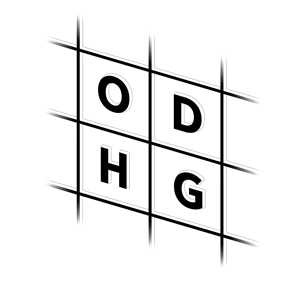
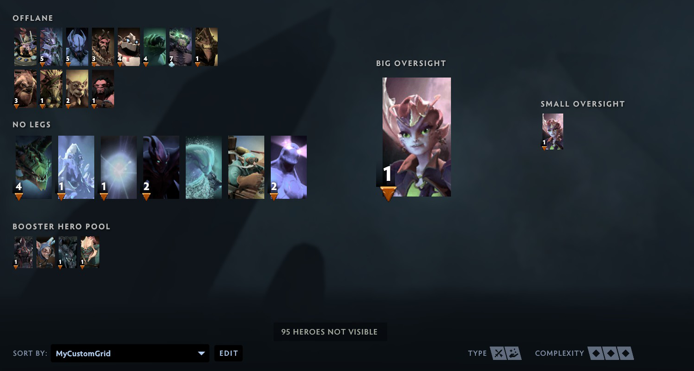
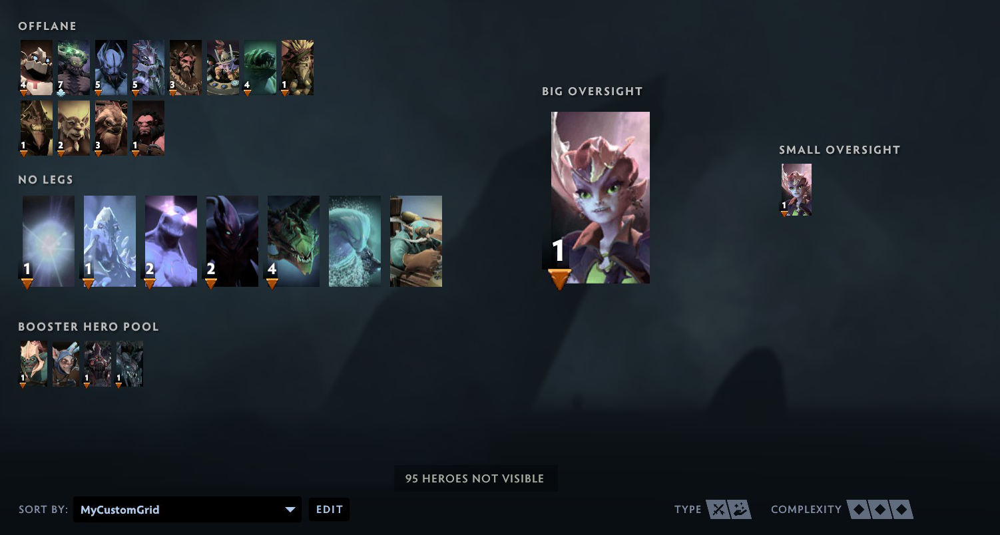
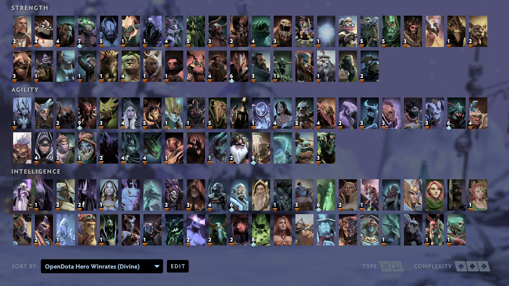

# ODHeroGrid


Small script that generates a custom Dota 2 Hero Grid layout of heroes sorted 
by winrate in public or professional games, using stats from OpenDota.

# Installation
```
pip install odherogrid
```

# Usage
```
Usage:
  odhg [OPTIONS]

Options:
  [-b, --brackets] BRACKET (default: 7)
    Which skill bracket to get winrates from.
      <1, herald, h>                          Herald
      <2, guardian, g>                        Guardian
      <3, crusader, c>                        Crusader
      <4, archon, a>                          Archon
      <5, legend, l>                          Legend
      <6, ancient, n>                         Ancient
      <7, divine, d, immortal, i>             Divine
      <8, pro, p, official, tournaments>      Pro
      <0, all, A>                             All
    Hero grids for multiple brackets can be generated by specifying the -b option several times.

  [-g, --layout] LAYOUTS (default: 1)
    How heroes should be grouped in the grid
      <1, mainstat, m, stat, stats>           Mainstat
      <2, attack, a, melee, range>            Attack
      <3, role, r>                            Role
      <0, none, n, all, everything>           None

  [-p, --path] PATH
    Specify absolute path of Dota 2 userdata/cfg directory.
    (It's usually better to run --setup to configure this path.)

  [-s, --sort] (flag)
    Sort heroes by winrate in ascending order. (Default: descending).

  [-S, --setup] (flag)
    Runs first-time setup in order to create a persistent config.

  [-n, --name] NAME
    Sort heroes by winrate in an already existing custom hero grid.

  [-h, --help] (flag)
    Show this message and exit.

```

# Examples


#### Use options stored in config. (Runs first-time setup if no config exists)
```
odhg
```
The config file will be stored as `~/.odhg/config.yml`

It is recommended to create a config rather than using command-line options.


#
## Bracket


#### Create grid for Herald hero winrates:
```
odhg --brackets 1
```


#### Bracket names can also be used:
```
odhg --brackets herald
```


#### Shorter:
```
odhg -b h
```


#
#### Create grids for Herald, Divine & Pro winrates:
```
odhg -b 1 -b 7 -b 8
```

#### Alternatively:
```
odhg -b h -b d -b p
```


#
#### Create grids for all brackets:
```
odhg -b 0
```


## Layout
#### Create grids for Divine hero winrates, grouped by Hero roles (Carry/Support/Flex):
```
odhg -g 3 -b 7
```

#### Name of layout method can also be used:
```
odhg -g role -b 7
```


## Path
#### Specify a specific Steam user CFG directory:
```
odhg --path /home/bob/Steam/userdata/420666/570/remote/cfg
```

## Name
#### Sort custom grids with `--name`
```
odhg --name MyCustomGrid -b 7
```
#### Before:

#### After:

# Screenshots


_Divine winrate hero grid generated 2020-01-26_
# Changelog

The format is based on [Keep a Changelog](https://keepachangelog.com/en/1.0.0/),

## 0.1.3 (February XXth, 2020)
### Added
- Nothing

### Changed
- Handling of multiple bracket arguments is now performed by `cfg.make_new_hero_grid()` (was `odhg.main()`).

## 0.1.2 (January 24th, 2020)
### Added
- Sorting of specific custom grids by using the `--name` parameter

### Changed
- ~/.odhg/config.yml now lists full path of hero_grid_config.json instead of just its directory.