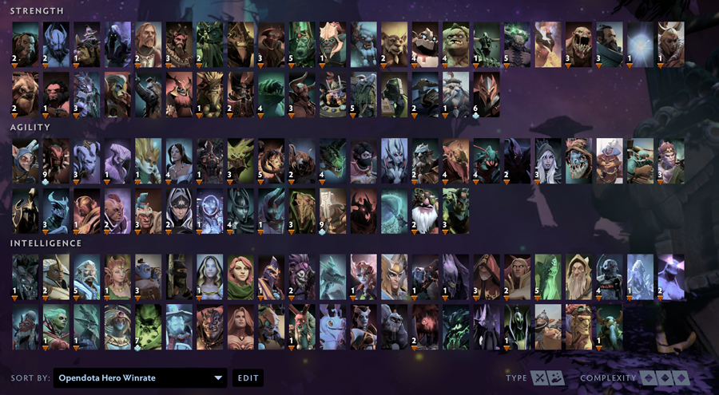

# ODHeroGrid


Small script that generates a custom Dota 2 Hero Grid layout of heroes sorted by winrate in public or professional games, using stats from OpenDota.


### Usage
```
python3.7 odhg.py [-b, --brackets] bracket (default: 7)
                    Which skill bracket to get winrates from.
                        <1, h, herald>                  Herald
                        <2, g, guardian>                Guardian
                        <3, c, crusader>                Crusader
                        <4, a, archon>                  Archon
                        <5, l, legend>                  Legend
                        <6, n, ancient>                 Ancient
                        <7, d, i, divine, immortal>     Divine/Immortal
                        <8, p, pro>                     Pro
                    Hero grids for multiple brackets can be generated by
                    specifying the -b option several times.
                  
                  [-g, --grouping] grouping (default: 1)
                    How heroes should be grouped in the grid
                        <1, m, stat>        Main stat (Str/Agi/Int)
                        <2, a, attack>      Attack type (Melee/Range)
                        <3, r, role>        Role (Carry/Support/Flex)
                        <0, n, none>        Single category   
                        
                  [-p, --path] <path of Dota 2 userdata/cfg directory>
                  
                  [-s, --sort] <asc/desc> (default: desc)
                  
                  [--setup] (flag)
                    Runs first-time setup in order to create an ODHG config.
```

# Examples


#### Use program defaults. (Runs first-time setup if no config.yml exists)
```bash
python3.7 odhg.py
```

#### Corresponding options:
```bash
python3.7 odhg.py -b 7 -g 1 -sort desc
```


#
## Bracket


#### Create grid for Herald hero winrates:
```bash
python3.7 odhg.py --bracket 1
```

#### Bracket names can also be used:
```bash
python3.7 odhg.py --bracket herald
```

#### Shorter:
```bash
python3.7 odhg.py -b 1
python3.7 odhg.py -b h
```

#### Create grids for Herald, Divine & Pro winrates:
```bash
python3.7 odhg.py -b 1 -b d -b pro
```

#### Create grids for all brackets:
```bash
python3.7 odhg.py -b 0
```


#
## Grouping


#### Create grids for Divine hero winrates, grouped by Hero roles (Carry/Support/Flex):
```bash
python3.7 odhg.py -g 3
```

#### Name of grouping method can also be used:
```bash
python3.7 odhg.py -g role
```


#
## Path


#### Specify a specific Steam user CFG directory:
```bash
python3.7 odhg.py --path C:\Program Files (x86)\Steam\userdata\420666\570\remote\cfg
```


# Screenshots


_Divine winrate hero grid generated 2019/12/06_