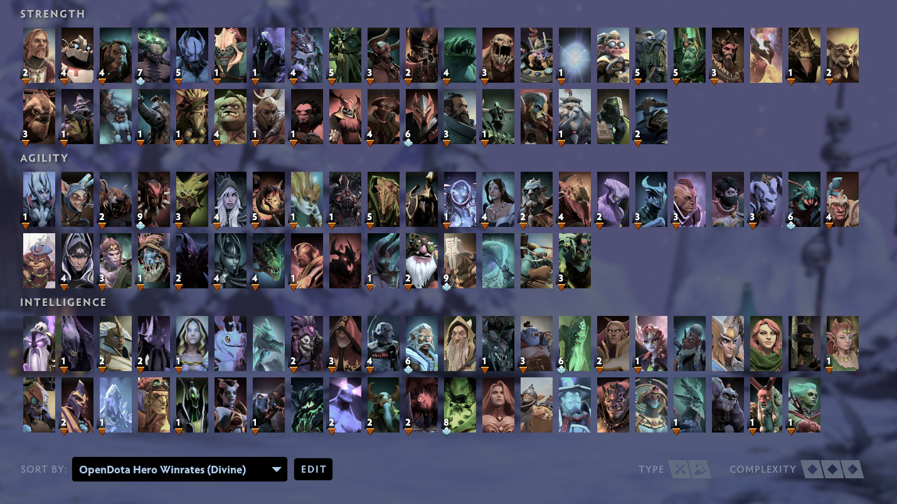

# ODHeroGrid


Small script that generates a custom Dota 2 Hero Grid layout of heroes sorted 
by winrate in public or professional games, using stats from OpenDota.

# Installation
```
pip install odherogrid
```

# Usage
```
odhg  [-b, --brackets] BRACKET (default: 7)
        Which skill bracket to get winrates from.
            <1, herald, h>                          Herald
            <2, guardian, g>                        Guardian
            <3, crusader, c>                        Crusader
            <4, archon, a>                          Archon
            <5, legend, l>                          Legend
            <6, ancient, n>                         Ancient
            <7, divine, d, immortal, i>             Divine
            <8, pro, p, official, tournaments>      Pro
            <0, all, A>                             All

      [-g, --grouping] GROUPING (default: 1)
        How heroes should be grouped in the grid
            <1, mainstat, m, stat, stats>           Mainstat
            <2, attack, a, melee, range>            Attack
            <3, role, r>                            Role
            <0, none, n, all, everything>           None

      [-p, --path] PATH
        Specify absolute path of Dota 2 userdata/cfg directory.
        (It's usually better to run --setup to configure this path.)

      [-s, --sort] (flag)
        Sort heroes by winrate in ascending order. (Default: descending).

      [-S, --setup] (flag)
        Runs first-time setup in order to create a persistent config.

      [-h, --help] (flag)
        Displays command usage information.

```

# Examples


#### Use options stored in config. (Runs first-time setup if no config exists)
```bash
odhg
```
The config file will be stored as `~/.odhg/config.yml`

It is recommended to create a config rather than using command-line options.


#
## Bracket


#### Create grid for Herald hero winrates:
```bash
odhg --brackets 1
```

#### Bracket names can also be used:
```bash
odhg --brackets herald
```

#### Shorter:
```bash
odhg -b 1
odhg -b h
```

#
#### Create grids for Herald, Divine & Pro winrates:
```bash
odhg -b 1 -b 7 -b 8
```
#### Alternatively:
```bash
odhg -b h -b d -b p
```
#
#### Create grids for all brackets:
```bash
odhg -b 0
```


#
## Grouping


#### Create grids for Divine hero winrates, grouped by Hero roles (Carry/Support/Flex):
```bash
odhg -g 3 -b 7
```

#### Name of grouping method can also be used:
```bash
odhg -g role -b 7
```


#
## Path


#### Specify a specific Steam user CFG directory:
```bash
odhg --path C:\Program Files (x86)\Steam\userdata\420666\570\remote\cfg
```


# Screenshots


_Divine winrate hero grid generated 2019-12-23_
